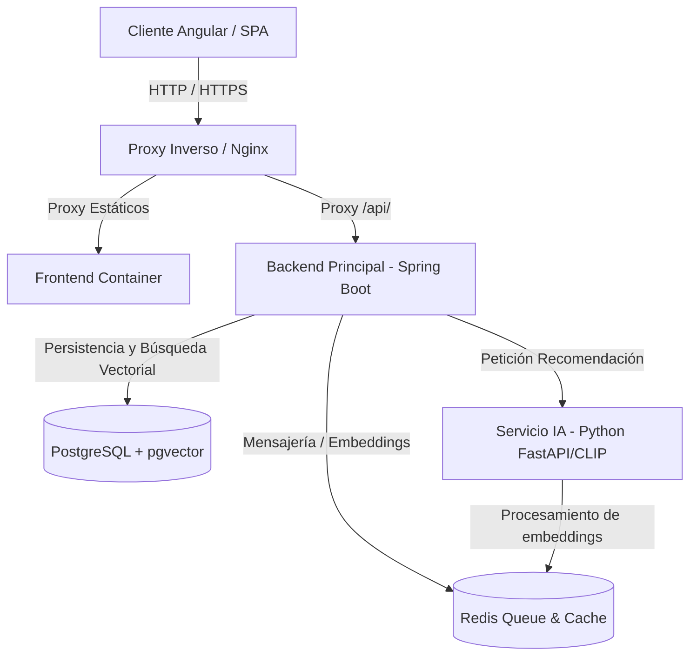

# 🎈 BalloonStudio - Plataforma de Decoraciones y Diseño

¡Bienvenido a **BalloonStudio**! Esta es una plataforma web integral diseñada para la gestión, diseño y recomendación visual de decoraciones con globos y eventos. El sistema incorpora inteligencia artificial para realizar búsquedas y recomendaciones inteligentes de artículos basadas en similitud visual y texto.

---

## 🌐 Enlace del Proyecto Desplegado
Puedes acceder a la versión de producción en:
👉 **[https://balloonstudiosw.onthewifi.com](https://balloonstudiosw.onthewifi.com)**

---

## 🔑 Credenciales de Acceso por Rol
Para facilitar las pruebas del sistema en el entorno desplegado, puedes utilizar las siguientes credenciales preconfiguradas:

| Rol 👤 | Usuario 📧 | Contraseña 🔑 | Descripción |
| :--- | :--- | :--- | :--- |
| **Administrador** | `admin1` | `123123` | Control total del inventario, pedidos, reportes y configuración. |
| **Empleado** | `fernandoe` | `123123` | Gestión de reservas, pedidos y actualización de estados. |
| **Cliente** | `fernandoc` | `123123` | Creación de diseños, visualización de catálogo y reservas. |

---

## Arquitectura del Sistema
El proyecto está construido bajo una arquitectura de microservicios e integración modular mediante contenedores de Docker:



### Tecnologías Utilizadas:
*   **Frontend:** Angular (Basado en la plantilla premium Sakai NG).
*   **Backend Principal (`ms-decoraciones`):** Java Spring Boot (REST API, Spring Security, JWT, JPA, Hibernate).
*   **Microservicio de IA (`ms-ia`):** Python (FastAPI, integrando modelos CLIP de OpenAI y SentenceTransformers para generación de embeddings de imágenes y texto).
*   **Base de Datos:** PostgreSQL con la extensión **pgvector** para indexación y búsqueda por similitud de vectores.
*   **Caché y Cola de Mensajería:** Redis (para coordinar el procesamiento asíncrono de imágenes y embeddings).
*   **Pasarelas y Servicios Externos:** Integración con Stripe, PagoFácil y Resend para notificaciones por correo.

---

## Despliegue Local con Docker Compose

Para levantar todo el entorno de manera local con un solo comando, asegúrate de tener instalado **Docker** y **Docker Compose**, y sigue estos pasos:

### 1. Configurar Variables de Entorno
Crea un archivo `.env` en la raíz del proyecto (junto a `docker-compose.yml`) con las credenciales necesarias. Ejemplo:
```env
DB_USER=postgres
DB_PASSWORD=tu_password_segura
DB_NAME=decoraciones
DB_PORT_OUT=5433

REDIS_PORT_OUT=6379

FRONTEND_PORT_OUT=80
BACKEND_PORT_OUT=8080
IA_PORT_OUT=8003

# Claves de terceros (opcional para desarrollo básico)
RESEND_API_KEY=re_123456789
STRIPE_API_KEY=sk_test_...
```

### 2. Iniciar la Aplicación
Ejecuta el siguiente comando para compilar e iniciar todos los servicios en segundo plano:
```bash
docker compose up --build -d
```

### 3. Acceso Local
Una vez que todos los contenedores estén listos, puedes acceder a:
*   **Frontend (Aplicación Web):** `http://localhost` (o el puerto configurado en `FRONTEND_PORT_OUT`)
*   **API Gateway / Backend:** `http://localhost:8080/api`
*   **Documentación Swagger de la API:** `http://localhost:8080/api/swagger-ui/index.html`
